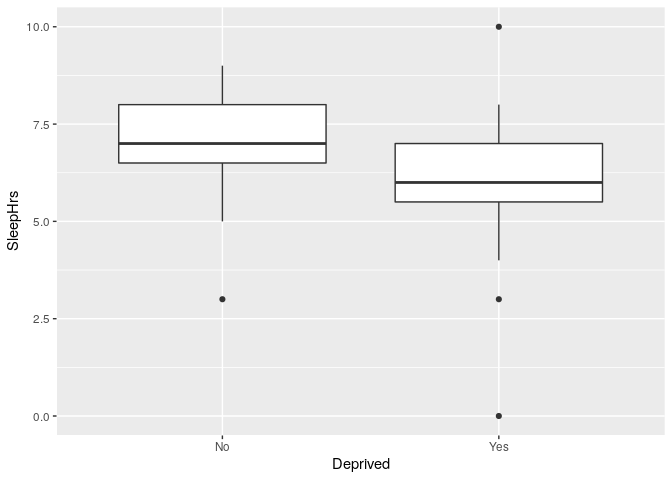

<!-- README.md is generated from README.Rmd. Please edit that file -->

# datasets

<!-- badges: start -->

<!-- badges: end -->

The goal of datasets is to provide a home for data sets for my courses,
from various textbooks. I favour text files, but I grab what I can.

## example

Load Tidyverse first:

``` r
library(tidyverse)
#> ── Attaching packages ────────────────────────────────────────────────────────────────────────────────────────────── tidyverse 1.3.0 ──
#> ✓ ggplot2 3.3.0     ✓ purrr   0.3.3
#> ✓ tibble  3.0.0     ✓ dplyr   0.8.5
#> ✓ tidyr   1.0.2     ✓ stringr 1.4.0
#> ✓ readr   1.3.1     ✓ forcats 0.5.0
#> ── Conflicts ───────────────────────────────────────────────────────────────────────────────────────────────── tidyverse_conflicts() ──
#> x dplyr::filter() masks stats::filter()
#> x dplyr::lag()    masks stats::lag()
```

The data set `deprived` from Utts and Heckard is from a survey of
students from a statistics class. Each student was asked whether they
generally felt sleep-deprived or not, and also how many hours they
usually slept per night:

``` r
load("utts-heckard/deprived.rdata")
deprived
#>    d  s
#> 1  N  8
#> 2  N  6
#> 3  N  7
#> 4  Y  6
#> 5  Y  6
#> 6  Y  7
#> 7  Y  6
#> 8  Y  7
#> 9  N  9
#> 10 N  7
#> 11 N  8
#> 12 N  7
#> 13 Y  7
#> 14 Y  3
#> 15 Y  5
#> 16 N  7
#> 17 N  9
#> 18 N  3
#> 19 Y  6
#> 20 Y  7
#> 21 N  8
#> 22 N  8
#> 23 N  6
#> 24 Y  7
#> 25 N  8
#> 26 N  8
#> 27 N  7
#> 28 N  5
#> 29 N  8
#> 30 Y  6
#> 31 Y 10
#> 32 Y  6
#> 33 N  8
#> 34 Y  6
#> 35 N  7
#> 36 Y  6
#> 37 Y  6
#> 38 Y  8
#> 39 Y  0
#> 40 Y  6
#> 41 Y  5
#> 42 N  7
#> 43 Y  5
#> 44 N  7
#> 45 N  6
#> 46 N  8
#> 47 Y  6
#> 48 Y  6
#> 49 Y  6
#> 50 Y  6
#> 51 Y  5
#> 52 N  7
#> 53 Y  5
#> 54 N  8
#> 55 N  7
#> 56 Y  6
#> 57 Y  7
#> 58 N  7
#> 59 N  7
#> 60 Y  6
#> 61 Y  6
#> 62 Y  6
#> 63 N  6
#> 64 Y  6
#> 65 Y  7
#> 66 N  6
#> 67 Y  6
#> 68 Y  6
#> 69 Y  6
#> 70 Y  7
#> 71 Y  5
#> 72 Y  5
#> 73 Y  7
#> 74 N  8
#> 75 N  6
#> 76 Y  7
#> 77 Y  5
#> 78 Y  6
#> 79 Y  7
#> 80 Y  4
#> 81 Y  5
#> 82 N  6
#> 83 N  7
#> 84 Y  7
#> 85 Y  6
#> 86 Y  5
```

One would imagine that sleep-deprived people got less sleep:

``` r
ggplot(deprived, aes(x=d, y=s)) + geom_boxplot()
```

<!-- -->

There are outliers in both groups, but the answer appears to be yes. Is
that significant?

``` r
t.test(s~d, data=deprived, alternative="greater")
#> 
#>  Welch Two Sample t-test
#> 
#> data:  s by d
#> t = 4.0975, df = 79.624, p-value = 4.99e-05
#> alternative hypothesis: true difference in means is greater than 0
#> 95 percent confidence interval:
#>  0.6627109       Inf
#> sample estimates:
#> mean in group N mean in group Y 
#>        7.057143        5.941176
```

Yes, although it might be good to be concerned about the outliers.
